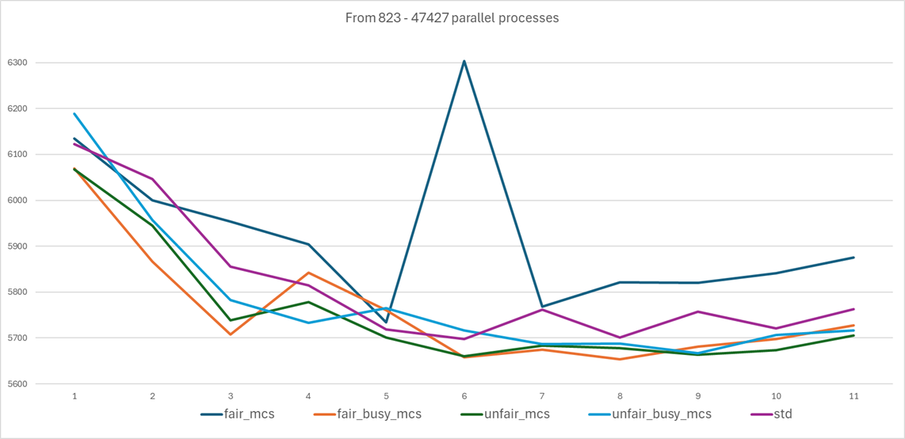

# MCS-variations
MCS Queued Lock variations.

#Preface

If the process by which a task is queued, becomes so burdensome, that it is better off retrying to skip the queueing completely... during each step of the queuing process... then skipping it does not make it less burdensome.<br>
The time spent on the attempt was already lost, this is processing power lost... heat produced.
This methodology attempts to spend so little time on the queuing that:

 - A) little time is spent on parking, none if the task is found to be second in attendance. (also present in `AbstractQueuedSynchronizer`)
 - B) fast_path allows the polling and awakening before lock release.
 - C) if the queuing completes, the queuing process was so fast that it was meant to be queued no matter if the task is immediately polled after the fact.


# Acknowledgement:
Prof. Douglas Lea generalized the linked queue push + parking + awakening + polling behavior so that it can be simultaneously applied on 5 different components of the standard library.<br>
The bytecode generated is not bothered by the amount of branching of the different cases…. Maybe because the JIT can infer parameter “finality” (generating different sequences to loop on, even before the parameters enter the for loop) dismissing unused cases from the get-go.<br>
Maybe creating multiple spinlock one for each parameter case, precompiled from the get-go and eventually de-virtualized into the call as a consequence of JIT sophistication.<br>
Maybe CLH is just THAT GOOD.<br>
Maybe the usage of Unsafe operations really do “go a long way”.<br>
Maybe mr. Lea’s strategy of optimistically retrying to acquire the lock after EACH ALLOCATION before queue insertion… does pay off.<br>
But you’ll see that even with the over-engineering (a requirement of the library) of the `ReentrantReadWriteLock` this standard strategy that Java uses for Thread synchronization is a tough match for both bare-bones MCS strategies… and even for language specific syntax components like `synchronized` keyword.<br>
This is not an in-depth analysis of what the JIT or javac turn the code into.<br>
This is a brute raw `System.nanoTime()` measurement of each approach, with some theoretical assumptions of which would be the best approach.<br>
A naive wishful theory… if you will.<br>
I chose the time performance test first as it is usually the first barrier of credentialist filter of validity.
 # Proposal / Hypothesis.
 
CLH (Craig, Landin and Hagersten) queue is a structure meant for scalable parallel synchronization.<br>
It works by enqueuing arriving processes in a linked structure, where the First to arrive, will be the first to be attended(served).
The enqueueing process (in the case of the AbstractQueuedSynchronizer) consist in aggressively CAS-ing the TAIL, ensuring both a happens-before and after, which allows the volatile setting (set-release) of a `predecessor.next`.
The `AbstractQueuedSynchronizer` uses a Node inner flag to signal individual parking state (“locality”) similar to the MCS strategy.<br>
What makes `AbstractQueuedSynchronizer` a CLH queue?<br>
The fact that each Node has a `prev` field, even if... strictly speaking all a linked iterable queue needs is a `next` reference.<br>

<p><b>NOTE: </b><br>
In theory a pure CLH should busy-wait on <b>PREDECESSOR NODES</b> something that can only be possible via <b>PROACTIVE LOADS</b> viable via busy-waiting on the predecessor's flag.<br>
A “pure” CLH queue would be nonviable on scale since the spinning of thousands of parallel processes would clog the `ExecutorService` (if available) or clog the OS scheduler, not even yielding strategies would work (A “yield storm” could make the entire program become de-prioritized).<br>
Since a parking mechanic should be added to prevent this, both CLH and MCS need for the "unparking" to be performed <b>REACTIVELY</b> by the running HEAD process.<br>
`AbstractQueuedSynchronizer` does this during the "release"/`unlock` phase.

<p>In this case the Nodes are in charge of polling themselves once awaken by the release phase, since a DUMMY head is used… the polling is done effectively on the second place of the queue, inferred by checking whether `node.prev` is equal to the `head`.
But node.prev is not only used for checking this… it also allows to proactively dequeue nodes… action that is not used by the ReentrantReadWriteLock implementation.<br>
Most of the drawbacks of insertions are resolved by retrying during each step of the process, in-between each main action (like Object creation), to optimistically re-acquire the main lock (`state`), abandoning any further attempts at self queuing itself to the `TAIL`.

 - Pure MCS advantages:

MCS’ strategies, spread the CAS latency across multiple `node.next`, as opposed to CLH which focuses its CAS pressures on a single point of contention on `TAIL` (in the `AbstractQueuedSynchronizer` case this is needed because each `prev` field needs to be set), fetching a new memory location on failure, helps offset the latency on main memory, diverging it to all individual Threads equally.<br>
The addition of a “fast-path” atomic flag (similar to AbstractQueuedSynchronizer’s `state`), also grants us an additional spin-locking point, point which grants us an avenue by which we can prematurely release the next process, offering an eager context-switch restoration preemption before the current node’s turn even ends.<br>
```java
    public void acquire() {
        if (!FAST_PATH.compareAndSet(this, false, true)
        ) {
            // Node insertion...

            // ------ Ths middle point allows a preemptive polling of the next node, leving it spin-waiting until the FAST_PATH flag becomes available again.

            while (!FAST_PATH.compareAndSet(this, false, true)) {
                Thread.onSpinWait();
            }


            // -------- Node polling

            // ------- end

        }
    }
```

Lea's implementation offsets some drawbacks of CLH, by optimistically trying to acquire the lock (similar to our fast_path flag) during EACH STEP of the queue insertion.

<p> I don't need to do this... since the Node insertion is as straight-forward as possibly allowed by the language.<br>
Any additional failure will only be due to CAS failure.... e.g, <b>contention deserving of enqueuing anyway.</b><br>

# Test

In this test many other MCS and synchronization strategies have been tested.<br>
The main focus of this test, our main hypothesis is called `UnfariMCS` detailed in the charts as "unfair_mcs".<br>

This implementation of MCS, allows the HEAD to be “semi-awake”, busy-waiting on the release of the lock.
And once the lock is finally acquired, immediately waking up the next node, so that it has a chance to context-switch before the synchronized body sequence even finishes processing before releasing the lock.
My argument is that MCS’ type strategies are more efficient energy-wise since they allow a faster sleep (on 3rd places onwards inside the queue in my specific implementation), and a faster wake-up (as the HEAD and second place will always stay awake busy-waiting).
The contention being spread across individual `node.next` references dissipates the latency contention, relieving it on unbounded node CAS’es, instead of a single focused CAS on TAIL.

<p> I understand the tests should focus more on energy usage, since that is the main core of the hypothesis but as stated bellow, I'd need a better hardware to test this.<br>
Also, reiterating myself: <br>
"I chose the time performance test first as it is usually the first barrier of credentialist filter of validity."

 - Methodology:
   - First method:  
Each tier represents the median nanotime spent between the first and last Thread processed.<br>
EACH time (before median calculation) was divided by `1_000` for ALL times measured, this way we can handle smaller values.<br>
Beginning at 10 parallel processes, each lower tier multiplies the previous by 1.5.<br>
Until the last tier (tier 22) ends at 47427 parallel processes.<br>
We “normalize” the values by dividing each tier by their corresponding multiplier, bringing all values back towards a visibly measurable line.
```plaintext
Threads  |        MEDIAN      |      “Normalized”
   10    |      median_tier1  |   median_tier1
   15    |      median_tier2  |   INT(median_tier2/1.5)
   22    |      median_tier3  |   INT(median_tier3/1.5^2)
```
The error will (hopefully) not influence the fair measurement of competence as each strategy will be subjected to the same function.
The purpose is to have a way to visibly acknowledge any differences.

#Results

More results at `mcs_variations_benchmarks.xlsx`

- JDK:
    - Amazon Corretto 16.0.2
- OS:
    - Processor	AMD Ryzen 5 5500U with Radeon Graphics            2.10 GHz
    - Installed RAM	16.0 GB (15.3 GB usable)
    - System type	64-bit operating system, x64-based processor

- Legend
    - `sync` = Java's `synchronize` keyword.
    - `std` = Java's `ReentrantReadWriteLock`.
    - `unfair_mcs` = UnfairMCS main proposal of this study.

<p align="center">
  
</p>

 -
   - Second method:
   
   We sort each Tier inferring WHICH is the strategy with THE LOWEST value (MIN). This is our pivot value.
We assign this strategy a value of ONE by dividing it against itself, then we let EVERY OTHER strategy within the same tier to ALSO BE DIVIDED by this MIN.
Then we add each strategy of each tier.

The one with the least value will be the fastest.

This way we can infer which is “the fastest”, “the slowest” and every other strategy in-between via a heat-map.
We call this methodology “Deviations from MIN” which is not given in any percentage value (so not really a “deviation”)… and just shows which is the absolute value difference between each strategy.
We don’t need a precise logarithmic measurement since I don’t have the proper hardware for this task (we would need more than 47k Threads to test this.) but in the test results you can begin seeing exponential differences at the tier 20+ which begins to diverge deeply between “std(standard: ReentrantReadWriteLock)” and other MCS variations.
I was just interested in “overall ontological fastness”, that’s all.

<p align="center">
  
</p>
